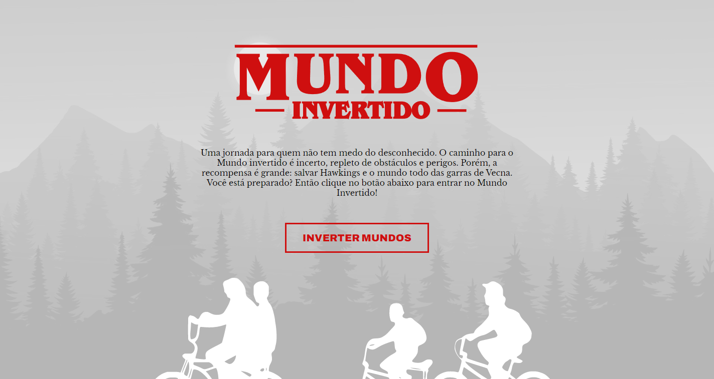
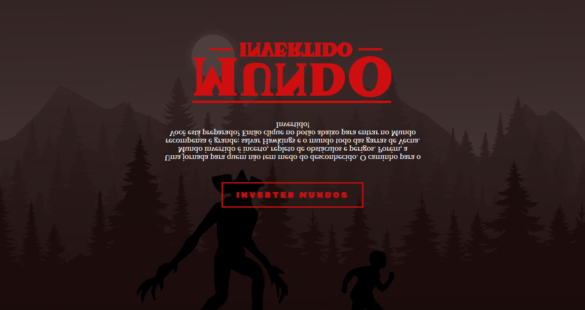

    

-------

> Project developed for pratice. Mundo Invertido is a page about the serie Stranger Things.

## :hammer: Topics Covered

- `1`: HTML
    - Structuring the page 
    - Semantics
    - Accessibility
    - Web Scraping
    - SEO
- `2`: CSS
    - Placements
    - Pseudo-elements
    - Pseudo-classes
    - Flexbox
    - Animations
- `3`: JavaScript
    - Introduction to JavaScript
    - DOM manipulation
    - Introduction to Firebase
    - Integration with Firebase

## 📁 Project access

You can access the page [here](https://thaisdsandim.github.io/mundo-invertido/).

## ✔️ Tools used

 
  

## 👩 About me

   

[Thaís Sandim](https://github.com/thaisdsandim), an Administrator who is learning to be a Dev.
